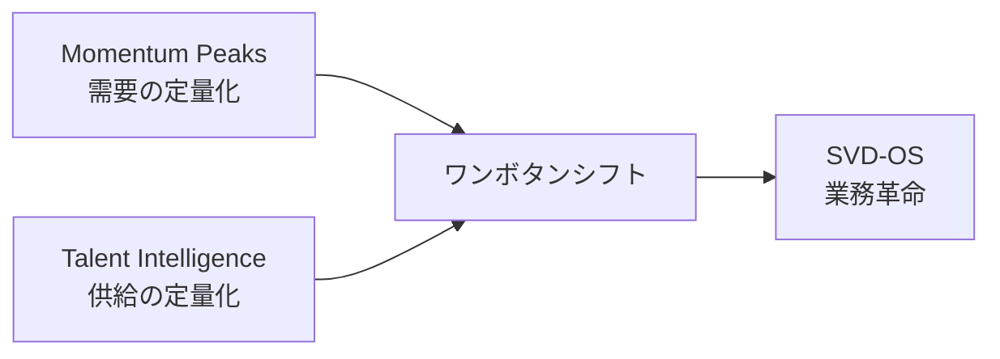

# Momentum Peaks — 設計図 Blueprint

> SAPPORO VIEWTIFUL DINING — 業界の「なんとなく」を排除する
> Version 2.0 | 2026-02-13

---

## 1. Philosophy — 哲学

### なぜ Momentum Peaks か

飲食業界には**「なんとなく」**が蔓延している。

- 「去年もこうだったから」
- 「なんとなく忙しそう」
- 「経験的にこの時期は暇」

**Momentum Peaks（MP）はこれを排除する。**

すべてに**「Why」**を問う。  
なぜ今日お客様が来るのか。なぜ来ないのか。  
その行動と思考に「なぜ？」を問い、最適解を手繰り寄せる。

### 定数 → 変数 の因果関係

```
定数（環境要因） ──→ 変数（実績） ──→ データ
   原因                 結果              蓄積
   WHY                  WHAT              EVIDENCE
```

> [!IMPORTANT]
> 実績（変数）からランクを決めるのではない。
> 定数（環境要因）がランクを決め、変数はその検証である。

---

## 2. Scale — スケール

| 項目 | 値 |
|------|-----|
| 最高値 | **5.00** |
| 最低値 | **1.00** |
| レンジ | **4.00** |
| 精度 | 小数点2桁 |
| 刻み | 4.00 ÷ 24 ≒ **0.17pt** |

---

## 3. 24 LEVELS — 二十四節気インスパイア

### 原理

自然は**24の段階**で巡る。  
日本古来の二十四節気にインスパイアされた**24段階の需要格付けシステム**。

- 節気は「ランク名」ではない
- 節気は**原理**であり**着想**
- 月（12段階）より細かく、日（365段階）より扱いやすい粒度

### 5つのSEASON

| SEASON | LEVEL | Point | アクション |
|--------|-------|-------|-----------|
| 🔥 **TOP SEASON** | #1〜#5 | 5.00〜4.33 | 最大戦力投入・全力投球 |
| ⚡ **HIGH SEASON** | #6〜#10 | 4.17〜3.50 | 攻めのオペレーション |
| 🌊 **FLOW SEASON** | #11〜#15 | 3.33〜2.67 | 標準運転・安定航行 |
| 📉 **LOW SEASON** | #16〜#20 | 2.50〜1.83 | 省力化・育成重点 |
| 🧊 **OFF SEASON** | #21〜#24 | 1.67〜1.17 | 最小体制・戦略構築 |

---

## 4. 2-Layer Structure — 定数と変数の二層構造

### Layer 1: 定数（KF1 = Key Factor ①）

**変えられない環境要因。** 拠点ごとに設定する「戦場の地形」。

```
KF1 = (①月別季節指数 + ②月別曜日指数 + ③月別来場者指数) / 3
```

| # | 要素 | 粒度 | スケール | 説明 |
|---|------|------|---------|------|
| ① | 月別季節指数 | 12ヶ月 | 1.00〜5.00 | その月の季節ポテンシャル |
| ② | 月別曜日指数 | 7曜日→月別平均 | 2.00〜5.00 | 月内の曜日構成が生む需要 |
| ③ | 月別来場者指数 | 直近3ヵ年平均 | 1.00〜5.00 | 拠点への人流（来場者数） |

> 24節気への展開: 各日の属する月のKF1を適用。節気は月と週の間の粒度として24ランキングの基盤となる。

### Layer 2: 変数（KF2/KF3）

**定数がもたらした結果。** 過去の実績データ。

| # | 要素 | 内容 | スケール |
|---|------|------|---------|
| KF2 | 月別売上平均 | 過去の日別売上を月別平均化 | 1.00〜5.00 |
| KF3 | 月別客数平均 | 過去の日別客数を月別平均化 | 1.00〜5.00 |

---

## 5. Calculation — 計算式

### Step ①〜④: 定数の算出（拠点レベル）

```
Step① 月別季節指数を設定（拠点×月の5段階評価）
Step② 曜日指数(月2/火2/水2/木3/金4/土5/日4)の月別平均を算出
Step③ 直近3ヵ年の月別来場者数から5段階指数を算出
Step④ KF1 = (① + ② + ③) / 3  → TOTAL拠点指数
```

### Step ⑤〜⑥: 変数の算出（店舗レベル）

```
Step⑤ 過去の月別売上平均 → 最大月を5.00として正規化 → KF2
Step⑥ 過去の月別客数平均 → 最大月を5.00として正規化 → KF3
```

### Step ⑦: MP Point の統合

```
MP Point = (KF1 + KF2 + KF3) / 3
```

### Step ⑧: 24 LEVELS への展開

```
全24節気のMP Pointを降順ソート → Rank 1〜24
Level Point = 5.00 - (Rank - 1) × (4.00 / 24)
SEASON = Rank に基づき TOP/HIGH/FLOW/LOW/OFF を付与
```

---

## 6. 拠点特性 — 4つの戦場

### 原典定数（R8 Excel）

| 月 | JW 藻岩山 | GA テレビ塔 | NP 大倉山 | BQ 赤れんが |
|----|----------|-----------|----------|-----------|
| 4月 | 2.72 | 2.62 | 1.99 | 2.62 |
| 5月 | 3.42 | 3.56 | 3.02 | 3.56 |
| 6月 | 3.64 | 3.58 | 3.29 | 3.58 |
| 7月 | 3.96 | 4.41 | 3.77 | 4.41 |
| 8月 | **4.47** | **4.47** | **4.47** | **4.47** |
| 9月 | **4.48** | 4.01 | 3.89 | 4.01 |
| 10月 | **4.43** | 3.86 | 3.68 | 3.86 |
| 11月 | 3.37 | 3.42 | 2.71 | 3.42 |
| 12月 | 4.13 | **4.51** | 3.39 | **4.51** |
| 1月 | 2.92 | 3.37 | 2.31 | 3.37 |
| 2月 | 3.50 | **4.45** | 2.78 | **4.45** |
| 3月 | 3.38 | 3.99 | 2.58 | 3.99 |

### TOP SEASON 比較

```
JW 藻岩山    : 白露  立秋  冬至  小暑  処暑   ← 夏〜秋が最強（夜景×紅葉）
GA テレビ塔   : 大雪  冬至  立春  小雪  小暑   ← 冬が圧倒的（雪まつり×イルミ×都心）
NP 大倉山    : 立秋  白露  夏至  小暑  秋分   ← 夏一極集中（観光地型）
BQ 赤れんが   : 大雪  冬至  立秋  小雪  小暑   ← GA同型（オフィス街×冬需要）
```

### OFF SEASON 比較

```
JW 藻岩山    : 大寒  小寒  立冬  清明   ← 冬の底＋春の運休
GA テレビ塔   : 小満  小寒  穀雨  清明   ← 春が弱い
NP 大倉山    : 啓蟄  雨水  小寒  清明   ← 冬〜春が一様に弱い
BQ 赤れんが   : 立夏  啓蟄  春分  清明   ← データ蓄積中
```

> 全拠点共通: **清明（4月上旬）は全拠点OFF SEASON** → 業界共通の構造的閑散期

---

## 7. Vision — 最終目標



### MP × TI = ワンボタンシフト

- **MP** = 「その日のSEASON LEVELは何か」（需要）
- **TI** = 「誰がどのスキルを持っているか」（供給）
- **Answer** = 適切なスキル × 適切な日 × 適切な人数

> ボタンひとつで最適シフトが提案される — AI時代のシフト作成

---

## 8. Data Foundation — データ基盤

| 拠点 | 実績日数 | 24 LEVELS CSV | 原典定数 |
|------|---------|--------------|---------|
| JW 藻岩山 | 1,065日 | ✅ `JW_mp_24levels.csv` | ✅ R8 Excel |
| GA テレビ塔 | 1,065日 | ✅ `GA_mp_24levels.csv` | ✅ R8 Excel |
| NP 大倉山 | 1,036日 | ✅ `NP_mp_24levels.csv` | ✅ R8 Excel |
| BQ 赤れんが | 304日 | ✅ `BQ_mp_24levels.csv` | ✅ R8 Excel |

---

> 関連: [[MP_Data_全拠点CSV基盤]] | [[MP_24LEVELS_設計書]] | [[00_SVD_MOC]]
> URL: https://wearemssatoshi.github.io/momentum-peaks/
