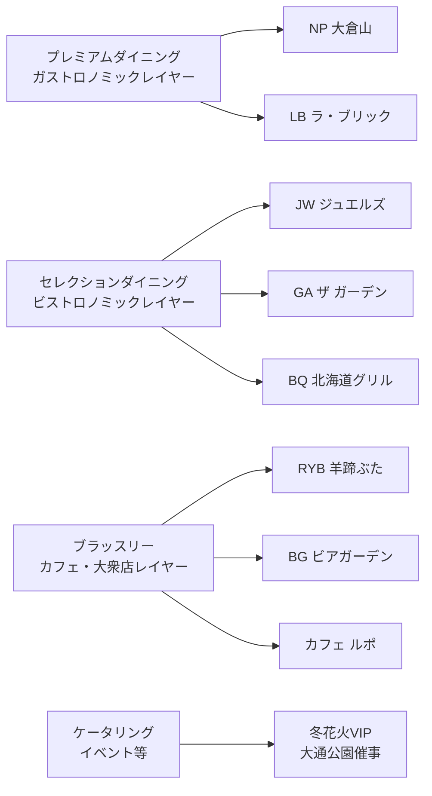

# SVD 事業計画方針 × ブランドガイド

> **ソース**: `SVD_事業計画方針説明o.pdf` / `SVD_BRANDGUIDE_v.1.1.pdf`
> **要約日**: 2026-02-12 by SAT & G
> **関連**: [[03_MP_MomentumPeaks]] [[MP_NextGen_売上データ基盤構想]]

---

## 🎯 ブランドアイデンティティ

### PURPOSE（存在意義）
**SAPPORO VIEWTIFUL DINING** は「札幌」という都市が有する「観光」や「食」を守り、北海道の文化を「未来」へと紡ぐ旗手となるレストラン・コレクティブ。

### MISSION（使命）
> **ここだけの美味しさ。ここだけのエンターテインメント。**

都市と自然が調和した「札幌」には、この街だからこそできる経験と体験がある。お客様の大切なシーンを彩る特別な料理と空間を提供し、「ここ」にしかない美味しさと感動を追求し届ける。

### VISION（目指すべき姿）
> **この街の食と文化と物語を 100年先へ**

レストランの価値を「食」だけではなく「人生のストーリーを創る場所」へと進化させ、100年先も札幌市民に愛されるレストランづくりを行う。

### VALUE（行動指針）
> **街の未来をレストランからつくっていく**

単なる飲食店の運営ではなく、札幌の未来を形づくる存在になること。公共性と文化性を備えたレストランを育て、札幌の成長と共に新しい価値を創り出す。

---

## 📐 事業構造（3事業 × 2グループ）

### 3事業

| 事業 | 内容 | メッセージ |
|:--|:--|:--|
| **コア事業（Core）** | 観光×レストランの特性を強みに札幌市民にも愛される場所を創る | 札幌のメインダイニング |
| **ライフタイムクリエイト（LTC）** | プロポーズ・ウェディング・記念日等、人生の節目を彩る | 一生の思い出となる体験を |
| **ブランドプロダクト（BP）** | 商品開発・ギフト・食品販売・ECサイト | 札幌のブランドを世界へ発信 |

### 2グループ

#### Peak Side — 日常の景色が変わるSAPPOROの特等席
- **拠点**: 藻岩山・大倉山
- **テーマ**: 自然没入型 × エンターテインメント × 美食体験
- **ストーリー**: 「近くて遠い場所」を札幌の特等席へ。レストランから札幌の観光地をアップデート
- **実績**: JWは無名からスタートし「なかなか予約の取れないレストラン」へ成長

| 店舗 | レイヤー | カテゴリ |
|:--|:--|:--|
| ヌーベルプース大倉山（NP） | プレミアムダイニング | フランス料理/ファインダイニング |
| ザ ジュエルズ（JW） | セレクションダイニング | 札幌のメインダイニング |
| カフェ ルポ、セレステ | ブラッスリー | TAKEOUT |
| 大倉山冬花火VIP等 | ケータリング | イベント |

#### Urban Side — 世界が憧れるHOKKAIDOを味わう
- **拠点**: 大通公園・札幌駅中心
- **テーマ**: 都市型観光 × コレクティブな食体験
- **ストーリー**: 「食材一流、サービス三流」の固定観念を打破。北海道のレストラン文化を世界へ
- **ベンチマーク**: シンガポール三つ星レストラン「Odette」（Asia Best Restaurant Winner）

| 店舗 | レイヤー | カテゴリ |
|:--|:--|:--|
| ラ・ブリック サッポロ（LB） | プレミアムダイニング | フランス料理/ファインダイニング |
| ザ ガーデン サッポロ（GA） | セレクションダイニング | 札幌のメインダイニング |
| ルスツ羊蹄ぶた by BRIQUE（RYB） | ブラッスリー | 赤れんがテラス |
| さっぽろテレビ塔ビアガーデン（BG） | ブラッスリー | 大衆×ビール |
| 北海道グリル（BQ） | セレクションダイニング | 赤れんがテラス |

---

## 💰 実績と予算（R5→R6→R7）

### 全体推移

| 年度 | 売上 | 前年比 | 備考 |
|:--|---:|:--|:--|
| **R5** 実績 | ¥505,275千 | — | 3拠点7事業 |
| **R6** 決算見込 | ¥581,332千 | **115.1%**（+¥76,057千） | ポップアップ展開で予算大幅超過 |
| R6 予算 | ¥545,652千 | — | 予算比 **106.5%**（+¥35,681千） |
| **R7** 計画 | ¥725,896千 | **124.9%**（+¥144,564千） | 4拠点10事業（赤れんが新規） |

### R6年度 拠点別実績（決算見込）

| 拠点 | 売上 | 構成比 |
|:--|---:|:--|
| **TV TOWER** | ¥274,874千 | 47.3% |
| **Mt.MOIWA** | ¥181,482千 | 31.2% |
| **OKURAYAMA** | ¥124,975千 | 21.5% |
| **合計** | **¥581,332千** | 100% |

### R7年度 予算詳細

| グループ | 拠点 | 事業 | 予算 |
|:--|:--|:--|---:|
| **Peak Side** | Mt.MOIWA | JW | ¥140,108千 |
| | | TO | ¥24,209千 |
| | | **小計** | **¥164,317千** |
| | OKURAYAMA | NP | ¥98,216千 |
| | | RP | ¥9,212千 |
| | | CE | ¥19,537千 |
| | | **小計** | **¥126,965千** |
| | | **Peak計** | **¥291,282千（40.1%）** |
| **Urban Side** | TV TOWER | GA | ¥136,533千 |
| | | BG | ¥150,297千 |
| | | **小計** | **¥286,830千** |
| | AKARENGA | BQ | ¥90,114千 |
| | | YT | ¥57,670千 |
| | | **小計** | **¥147,784千** |
| | | **Urban計** | **¥423,315千（59.9%）** |
| | | **全体** | **¥725,896千** |

### SVDの認識する3つの課題（R6時点）

1. **トライアル層中心** — リピーターの割合が小さい
2. **ブランド認知が浅い** — 誕生したばかりのブランド、育成が急務
3. **人材確保・人材育成** — 常に人手不足の飲食業界

---

## 🏛️ 4レイヤー構造

---

## 🎭 LTC事業（Lifetime Story 5つのシーン）

1. **プロポーズプラン** — バラの花束で一生に一度の演出
2. **お顔合わせプラン** — 新たな家族の始まり
3. **レストランウェディング** — 札幌の特別なロケーション×提携企業
4. **記念日プラン** — 結婚記念日・誕生日「またここに帰ってきたい」
5. **ギフト（招待券）** — 「レストランを贈ろう」記憶に残るギフト

---

## 📱 SNS戦略・BP事業

- **LINE公式・Instagram** SNSおよびAI活用推進
- **マーチャンダイズ**（商品化計画）設計
- **食品・ワイン・アパレル等のOEM開発**
- **ブランドと知的財産（IP）を活用したEC販売**
- お食事招待券のWEB販売

---

## 🌍 世界への競争意識

> 「約10年前からベンチマークしているシンガポールの三つ星レストラン Odette は 2020年の Asia Best Restaurant Winner」

- 東京はミシュランガイド **18年連続 星付き掲載店数 世界第一位**
- 北海道は2012年・2017年の特別版以降発刊なく、2021年に公式掲載から外れた
- **「街の品格はレストランで知る」** — 札幌の都市力をレストランで証明する

---

## 🔗 売上データとの接続

この事業方針から導かれるデータ基盤の要件:

| 事業方針 | データ要件 | MP接続 |
|:--|:--|:--|
| Peak Side: JW主力 | JW 3年分完了 ✅ | 24節気×DINNER特化 |
| Urban Side: GA+BG | GA 3年分完了 ✅ | 24節気×BG夏季エース |
| Urban Side: BQ+YT | BQ 10ヶ月完了 ✅ | 24節気×4ch（L/AT/D/RYB） |
| R7予算¥725M | 全拠点予実管理 | 予算vs実績の自動比較 |

---

*A Beautiful story becomes your story*
