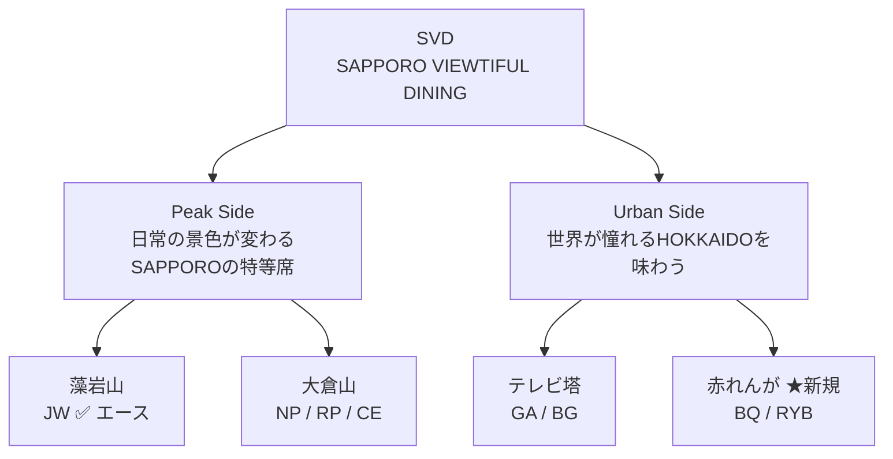

# R7 SVD PL × ブランド戦略 統合レポート

> **ファイル**: [R7_SVD_PL_forcast.xlsx](file:///Users/satoshiiga/dotfiles/SVD_budget/R7_SVD_PL_forcast.xlsx)
> **期間**: 令和7年度（第69期）— R7
> **単位**: 千円（税抜）

---

## 北極星

> **「北海道の海と大地が育む美味しさを、100年先のSAPPOROへ届ける。なぜなら僕らはSAPPORO VIEWTIFUL DININGだから。」**

```
Philosophy（北極星）→ Brand Guide（PMVV）→ 美味しさの定義 → Momentum Peaks → RESTAURANT OS
```

---

## ブランドアイデンティティ（PMVV）

| | 定義 |
|:--|:--|
| **PURPOSE** | 札幌の「観光」や「食」を守り、北海道の文化を「未来」へと紡ぐ旗手 |
| **MISSION** | ここだけの美味しさ。ここだけのエンターテインメント。 |
| **VISION** | この街の食と文化と物語を 100年先へ |
| **VALUE** | 街の未来をレストランからつくっていく |

**究極のゴール**: レストランの仕事を未来の子どもたちの憧れの仕事にする

---

## 事業構造（3事業 × 2グループ × 4レイヤー）

### 3事業

| 事業 | 内容 |
|:--|:--|
| **Core** | 観光×レストラン → 札幌のメインダイニング |
| **LTC** | プロポーズ・ウェディング・記念日 → 一生の思い出 |
| **BP** | 商品開発・ギフト・EC → 札幌のブランドを世界へ |

### 2グループ



### 4レイヤー × 店舗

| レイヤー | Peak Side | Urban Side |
|:--|:--|:--|
| **PD** プレミアムダイニング | NP（ヌーベルプース大倉山） | BQ（ラ・ブリック サッポロ） |
| **SD** セレクションダイニング | JW（ザ ジュエルズ） | GA（ザ ガーデン サッポロ） |
| ブラッスリー | カフェ ルポ / セレステ | RYB（ルスツ羊蹄ぶた）/ BG（ビアガーデン） |
| ケータリング | 大倉山冬花火VIP等 | — |

---

## R5 → R6 → R7 成長曲線

| 年度 | 売上 | 対R5実績 | 拠点 | 出店歴 |
|:--|--:|:--|:--|:--|
| **R5** 実績 | 505,275 | — | 3拠点7事業 | — |
| **R6** 決見 | 581,332 | **115%** | 3拠点 | — |
| **R7** 決見 | **726,857** | **144%** | **4拠点10事業** | 赤れんが新規 |

> [!IMPORTANT]
> R5対比 **144%**の実績。出店オフェンス（2020大倉山→2023テレビ塔→2025赤れんが）による事業規模拡大は戦略通り。

---

## PL構造 — R7予算対比

### 料飲部合計

| 科目 | ①R7予算 | ②R7決見 | 対予算比 |
|------|---------|---------|---------|
| 総売上高 | 708,235 | **726,857** | **103%** |
| 売上原価 | 215,191 | 245,264 | 114% |
| 売上総利益 | 493,044 | 481,593 | 98% |
| 人件費 | 281,263 | 306,130 | 109% |
| 物件費 | 184,876 | 199,742 | 108% |
| 減価償却費 | 24,621 | 27,719 | 113% |
| 販管費合計 | 490,760 | 533,591 | 109% |

### 店舗別 営業利益（R7予算 vs R7決見）

| 店舗 | レイヤー | R7予算 | R7決見 | 対予算比 |
|------|---------|--------|--------|---------|
| NP | PD | ▲14,568 | ▲18,436 | 127%赤字 |
| カフェ | ブラッスリー | ▲141 | ▲9,055 | — |
| ラウンジ | ブラッスリー | 8,662 | 11,883 | **137%** |
| JW | SD | 23,986 | 32,576 | **136%** |
| GA | SD | ▲8,622 | ▲17,807 | 206%赤字 |
| BG | ブラッスリー | 15,801 | 37,384 | **237%** |
| BQ | PD | 1,901 | ▲39,629 | 初年度投資 |
| RYB | ブラッスリー | 3,290 | 414 | 13% |
| 料飲共通 | — | ▲28,024 | ▲49,328 | 176%赤字 |
| **合計** | | **2,284** | **▲51,998** | — |

### 売上達成率（対R7予算）

| 店舗 | R7予算 | R7決見 | 達成率 |
|------|--------|--------|--------|
| NP | 98,217 | 101,507 | **103%** |
| カフェ | 9,212 | 8,566 | 93% |
| ラウンジ | 19,649 | 20,166 | **103%** |
| JW | 164,318 | 167,136 | **102%** |
| GA | 136,763 | 154,985 | **113%** |
| BG | 154,408 | 178,616 | **116%** |
| BQ | 75,366 | 61,371 | 81% |
| RYB | 50,302 | 34,511 | 69% |
| **合計** | **708,235** | **726,857** | **103%** |

---

## GOP視点 — 業界KPIでの再評価

> SATの言葉：「業界指標のGOPでみると非常に優秀な成績」

### 共通経費按分前のGOP

| 区分 | 金額（千円） | 評価 |
|:--|--:|:--|
| 既存事業GOP（共通・BQ除外） | **+36,959** | ✅ 優秀 |
| BQ（初年度特殊要因） | ▲39,629 | 🏗️ 投資回収期 |
| 料飲共通（付加価値創出コスト） | ▲49,328 | 👔 マネジメント投資 |
| **PL上の営業利益** | **▲51,998** | ← 構造的に赤字に見える |

> [!IMPORTANT]
> 共通経費49,328千円が「付加価値創出コスト」として本社・大倉山事業部・藻岩山事業部で按分されれば、料飲部のGOPは+36,959千円。しかし問屋がおろさない——だからこそ中長期での計画が必要。

### 料飲共通の内訳（決見）

| 科目 | 金額（千円） | 構成比 |
|:--|--:|:--|
| 社員給与費 | 39,163 | 79% — 正社員総合職2名 |
| 法定福利費 | 4,535 | 9% |
| 広告宣伝費 | 1,072 | 2% — 全社ブランド構築 |
| 旅費交通費 | 954 | 2% |
| 委託料 | 1,124 | 2% |
| その他 | 1,480 | 3% |
| **合計** | **49,328** | **100%** |

---

## FL比率分析

| 区分 | R7予算 | R7決見 | 対予算比 |
|------|--------|--------|:--:|
| F（原価率） | 30.4% | 33.7% | 111% |
| L（人件費率） | 39.7% | 42.1% | 106% |
| **FL計** | **70.1%** | **75.9%** | **108%** |

---

## SVDが認識する3つの課題 × R7 PLの接点

| 課題 | ブランドガイド | R7 PLでの指標 |
|:--|:--|:--|
| **リピーター育成** | トライアル層中心 | 原価率 予算対比111% |
| **ブランド認知** | 誕生したばかりのブランド | 広告宣伝費1,072千円 |
| **人材確保・育成** | 常に人手不足 | 正社員総合職2名→共通費176% |

---

## コア戦略

### Category 2.5 戦略 — Blue Ocean

SVDの主戦場は10,000-15,000円の戦略的空白地帯。「やらないことを決める」ことで、高付加価値ゾーンに集中投下。

---

## SVD-OS 7プロジェクト × PLの接続

| # | Project | PL接点 |
|:--|:--|:--|
| 1 | **MF** MINDFUL | スタッフ定着→人件費安定化 |
| 2 | **TI** Talent Intelligence | 適正配置→FL比率改善 |
| 3 | **MP** Momentum Peaks | 精度予測→原価率最適化 |
| 4 | **TSS** Team Synergy Stage | チーム力→リピーター育成 |
| 5 | **WINE** Wine OS | 飲料原価率直接改善 |
| 6 | **PL** PL Auto | リアルタイム利益可視化 |
| 7 | **OC** OpenClaw/SATOSHI | 業務効率化→販管費圧縮 |

**究極ゴール**: TI（Supply）× MP（Demand）= **One-Button Shift Generation**

---

## 中長期ロードマップ

| 年度 | 売上目標 | 対R5比 | テーマ |
|:--|--:|:--|:--|
| R7（今期） | 726M | 144% | 出店投資・組織強化 |
| R8 | 800M | 158% | BQ黒字転換・原価率改善 |
| R9 | 900M | 178% | LTC本格化・BP事業立上 |
| R10 | 1,000M | 198% | SVD-OS完全稼働 |
| 2030 | — | — | Asia Best Restaurant TOP100 |

> [!NOTE]
> PLの赤字は「投資の反映」。GOPの優秀さは「事業の実力」。ブランドガイドの軸で中長期成長を証明し、組織構造を変える力を持たなくてはならない。

---

*A Beautiful story becomes your story* ✨
